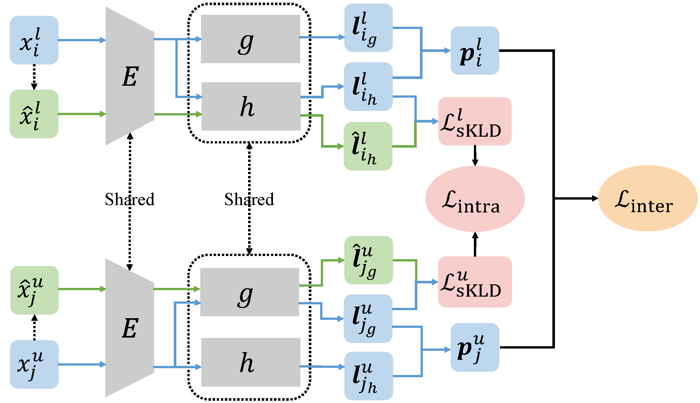

# Inter-Class and Intra-Class Constraints (IIC) for NCD

This repository is the official PyTorch implementation of our CVPR 2023 paper:

> Modeling Inter-Class and Intra-Class Constraints in Novel Class Discovery
>
> Wenbin Li, Zhichen Fan, Jing Huo, and Yang Gao
>
> Paper: [arXiv](https://arxiv.org/abs/2210.03591), [CVF paper](https://openaccess.thecvf.com/content/CVPR2023/papers/Li_Modeling_Inter-Class_and_Intra-Class_Constraints_in_Novel_Class_Discovery_CVPR_2023_paper.pdf), [CVF supplemental](https://openaccess.thecvf.com/content/CVPR2023/supplemental/Li_Modeling_Inter-Class_and_CVPR_2023_supplemental.pdf)



## Results

|                 Method                  |   Venue    | CIFAR10  | CIFAR100-20 | CIFAR100-50 | ImageNet-1K |
| :-------------------------------------: | :--------: | :------: | :---------: | :---------: | :---------: |
|                $k$-means                |  Classic   |   72.5   |    56.3     |    28.3     |    71.9     |
|                   KCL                   |  ICLR'18   |   72.3   |    42.1     |      –      |    73.8     |
|                   MCL                   |  ICLR'19   |   70.9   |    21.5     |      –      |    74.4     |
|                   DTC                   |  ICCV'19   |   88.7   |    67.3     |    35.9     |    78.3     |
|                   RS                    |  ICLR'20   |   90.4   |    73.2     |    39.2     |    82.5     |
|                   RS+                   |  ICLR'20   |   91.7   |    75.2     |    44.1     |    82.5     |
|                 OpenMix                 |  CVPR'21   |   95.3   |      –      |      –      |    85.7     |
|                   NCL                   |  CVPR'21   |   93.4   |    86.6     |      –      |    90.7     |
|                  Joint                  |  ICCV'21   |   93.4   |    76.4     |      –      |    86.7     |
|                  UNOv1                  |  ICCV'21   |   96.1   |    85.0     |    52.9     |    90.6     |
|                  UNOv2                  |  ICCV'21   |   93.3   |    90.5     |    62.3     |    90.7     |
|                DualRank                 | NeurIPS'21 |   91.6   |    75.3     |      –      |    88.9     |
|                  ComEx                  |  CVPR'22   |   93.6   |    85.7     |    53.4     |    90.9     |
| [rKD](https://arxiv.org/abs/2307.09158) |  ICCV'23   |    –     |    91.2     |    65.3     |      –      |
|                 **IIC**                 |  CVPR'23   | **99.1** |  **92.4**   |  **65.8**   |  **91.9**   |

## Requirements

Our implementation is based on [UNO v2](https://github.com/DonkeyShot21/UNO), please carefully follow the [installation](https://github.com/DonkeyShot21/UNO#installation) of their code.

## Datasets

Following the literature, we conduct our experiments on CIFAR10, CIFAR100 and ImageNet. You can also follow the steps on the repo of [UNO](https://github.com/DonkeyShot21/UNO#datasets) to download datasets.

By default, we save datasets in `/data/fzc`, $e.g.$, `/data/fzc/cifar-100-python` for CIFAR100.

## Checkpoints

The checkpoints we pretrained for 4 dataset splits (CIFAR10-5, CIFAR100-20, CIFAR100-50 and ImageNet) are available on [Google Drive](https://drive.google.com/drive/folders/1Nc7608ydfAQxODhrV_fqNUnkVpHDhzeA?usp=sharing).

## Logging

We use [Wandb](https://wandb.ai/site) for logging, please refer to [UNO](https://github.com/DonkeyShot21/UNO#logging) for more details.

**Note**: 

- Logging with Wandb requires the Internet accessibility during training. When debugging, it is best to pass `--offline` and then you can also manually upload the offline files to Wandb for further analysis. 
- We recommend "online" training as it provides more comprehensive records of the training process.

## Commands

IIC follows the two-stage training paradigm proposed in [UNO](https://github.com/DonkeyShot21/UNO), including supervised pretraining phase and novel class discovery phase. You can just use the pretrained checkpoints we provided to directly proceed to the novel class discovery phase, or you can also train your own model from scratch. By default, the pretrained checkpoints will be saved in `checkpoints_iic` folder.

### Pretraining

```shell
# Pretrain on CIFAR10-5
CUDA_VISIBLE_DEVICES=0 python main_pretrain.py \
--dataset CIFAR10 \
--gpus 1 \
--precision 16 \
--max_epochs 200 \
--batch_size 256 \
--num_labeled_classes 5 \
--num_unlabeled_classes 5 \
--comment 5_5

# Pretrain on CIFAR100-20
CUDA_VISIBLE_DEVICES=0 python main_pretrain.py \
--dataset CIFAR100 \
--gpus 1 \
--precision 16 \
--max_epochs 200 \
--batch_size 256 \
--num_labeled_classes 80 \
--num_unlabeled_classes 20 \
--comment 80_20

# Pretrain on CIFAR100-50
CUDA_VISIBLE_DEVICES=0 python main_pretrain.py \
--dataset CIFAR100 \
--gpus 1 \
--precision 16 \
--max_epochs 200 \
--batch_size 256 \
--num_labeled_classes 50 \
--num_unlabeled_classes 50 \
--comment 50_50

# Pretrain on ImageNet
CUDA_VISIBLE_DEVICES=0,1 python main_pretrain.py \
--dataset ImageNet \
--gpus 2 \
--precision 16 \
--max_epochs 100 \
--batch_size 256 \
--num_labeled_classes 882 \
--num_unlabeled_classes 30 \
--comment 882_30 \
--num_workers 8 \
--warmup_epochs 5 \
--distributed_backend ddp \
--sync_batchnorm
```

Durations on the Tesla V100 GPU:

- CIFAR10-5, CIFAR100-20, CIFAR100-50: about 2 hours.
- ImageNet: about 35 hours.

### Discovery

```shell
# Discover on CIFAR10-5
CUDA_VISIBLE_DEVICES=0 python main_discover_inter_intra.py \
--dataset CIFAR10 \
--gpus 1 \
--precision 16 \
--max_epochs 500 \
--batch_size 512 \
--num_labeled_classes 5 \
--num_unlabeled_classes 5 \
--pretrained /home/fzc/IIC/checkpoints_iic/pretrain-resnet18-CIFAR10-5_5.cp \
--num_heads 4 \
--overcluster_factor 10 \
--factor_inter 0.05 \
--factor_intra 0.01 \
--comment 5_5_inter_intra \
--multicrop

# Discover on CIFAR100-20
CUDA_VISIBLE_DEVICES=0 python main_discover_inter_intra.py \
--dataset CIFAR100 \
--gpus 1 \
--precision 16 \
--max_epochs 500 \
--batch_size 512 \
--num_labeled_classes 80 \
--num_unlabeled_classes 20 \
--pretrained /home/fzc/IIC/checkpoints_iic/pretrain-resnet18-CIFAR100-80_20.cp \
--num_heads 4 \
--overcluster_factor 5 \
--factor_inter 0.02 \
--factor_intra 0.01 \
--comment 80_20_inter_intra \
--multicrop

# Discover on CIFAR100-50
CUDA_VISIBLE_DEVICES=0 python main_discover_inter_intra.py \
--dataset CIFAR100 \
--gpus 1 \
--precision 16 \
--max_epochs 500 \
--batch_size 512 \
--num_labeled_classes 50 \
--num_unlabeled_classes 50 \
--pretrained /home/fzc/IIC/checkpoints_iic/pretrain-resnet18-CIFAR100-50_50.cp \
--num_heads 4 \
--factor_inter 0.05 \
--factor_intra 0.01 \
--comment 50_50_inter_intra \
--multicrop

# Discover on ImageNet
CUDA_VISIBLE_DEVICES=0,1 python main_discover_inter_intra.py \
--dataset ImageNet \
--gpus 2 \
--precision 16 \
--max_epochs 60 \
--batch_size 256 \
--num_labeled_classes 882 \
--num_unlabeled_classes 30 \
--pretrained /home/fzc/IIC/checkpoints_iic/pretrain-resnet18-ImageNet-882_30.cp \
--num_heads 2 \
--overcluster_factor 4 \
--factor_inter 0.05 \
--factor_intra 0.01 \
--comment 882_30-A_inter_intra \
--multicrop \
--base_lr 0.2 \
--warmup_epochs 5 \
--imagenet_split A \
--distributed_backend ddp \
--sync_batchnorm
```

**Note**: 

- Set `--num_heads` to `2` to speed up the calculation with almost no loss of clustering accuracy when discovering on ImageNet.
- To discover on ImageNet split `B`/`C`, you can just specify `--imagenet_split` with `B`/`C`.
- It takes about 21 hours on CIFAR10-5, 37 hours on CIFAR100-20/50 and 108 hours on ImageNet.
- You can run `main_discover.py`, `main_discover_inter.py`, `main_discover_intra.py` and `main_discover_mse.py` in a similar way to perform ablation study experiments.

## Acknowledgement

Our code is designed based on [UNO](https://github.com/DonkeyShot21/UNO). Many thanks for this great work. 

## Citation
If you use this code in your research, please cite our paper:
```
@InProceedings{Li_2023_CVPR,
    author    = {Li, Wenbin and Fan, Zhichen and Huo, Jing and Gao, Yang},
    title     = {Modeling Inter-Class and Intra-Class Constraints in Novel Class Discovery},
    booktitle = {Proceedings of the IEEE/CVF Conference on Computer Vision and Pattern Recognition (CVPR)},
    month     = {June},
    year      = {2023},
    pages     = {3449-3458}
}
```
Please also consider citing the paper of UNO:
```
@InProceedings{Fini_2021_ICCV,
    author    = {Fini, Enrico and Sangineto, Enver and Lathuili\`ere, St\'ephane and Zhong, Zhun and Nabi, Moin and Ricci, Elisa},
    title     = {A Unified Objective for Novel Class Discovery},
    booktitle = {Proceedings of the IEEE/CVF International Conference on Computer Vision (ICCV)},
    month     = {October},
    year      = {2021},
    pages     = {9284-9292}
}
```

## License

This repository is under [MIT license](https://github.com/FanZhichen/NCD-IIC/blob/main/LICENSE).
