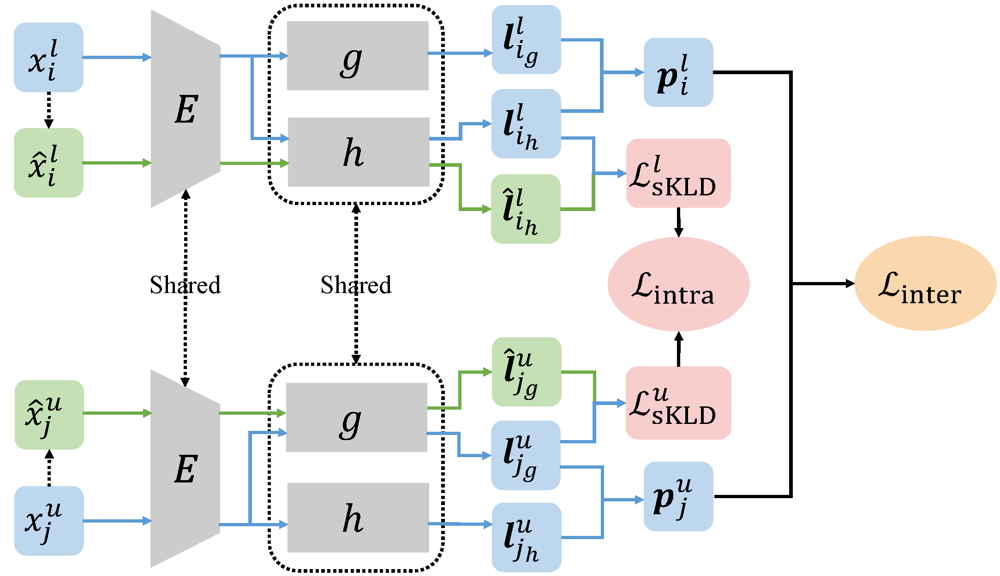

# Inter-Class and Intra-Class (IIC) for NCD

The official PyTorch implementation of our paper: Modeling Inter-Class and Intra-Class Constraints in Novel Class Discovery, CVPR 2023.




> Modeling Inter-Class and Intra-Class Constraints in Novel Class Discovery
>
> Wenbin Li, Zhichen Fan, Jing Huo, and Yang Gao
>
> Paper: [arXiv](https://arxiv.org/abs/2210.03591)

## Commands & Training & Testing

TODO


## Acknowledgement
Our code is designed based on [UNO](https://github.com/DonkeyShot21/UNO). Many thanks for this great work. 

## Citation
If you use this code in your research, please cite our paper:
```
@InProceedings{Li_2023_CVPR,
    author    = {Li, Wenbin and Fan, Zhichen and Huo, Jing and Gao, Yang},
    title     = {Modeling Inter-Class and Intra-Class Constraints in Novel Class Discovery},
    booktitle = {Proceedings of the IEEE/CVF Conference on Computer Vision and Pattern Recognition (CVPR)},
    month     = {June},
    year      = {2023},
    pages     = {xxx-xxx}
}
```
And please also consider citing the paper of UNO:
```
@InProceedings{Fini_2021_ICCV,
    author    = {Fini, Enrico and Sangineto, Enver and Lathuili\`ere, St\'ephane and Zhong, Zhun and Nabi, Moin and Ricci, Elisa},
    title     = {A Unified Objective for Novel Class Discovery},
    booktitle = {Proceedings of the IEEE/CVF International Conference on Computer Vision (ICCV)},
    month     = {October},
    year      = {2021},
    pages     = {9284-9292}
}
```

## License

This repository is under [MIT license](https://github.com/FanZhichen/NCD-IIC/blob/main/LICENSE).